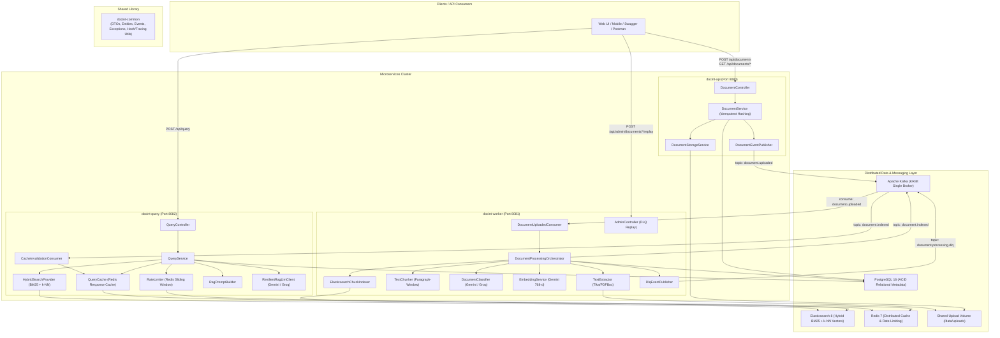

# AI-Powered Document Intelligence Pipeline (Microservices Architecture)

A production-grade, distributed document intelligence backend designed and implemented with **Java 21**, **Spring Boot 3**, **Apache Kafka (KRaft)**, **PostgreSQL**, **Elasticsearch 8**, **Redis**, and **LangChain4j**.

This platform provides end-to-end asynchronous document processing: ingestion with content-hash deduplication, text extraction (OCR/PDFBox/Tika), paragraph-aware chunking, LLM structured extraction, 768-dimensional vector embedding generation, Elasticsearch hybrid retrieval (BM25 + k-NN vector search), Redis response caching, sliding-window rate limiting, and grounded RAG question answering.

---

## System Architecture



---

## SOLID Principles Adherence

The codebase is built strictly adhering to the **SOLID principles**:

- **Single Responsibility Principle (SRP)**:
  - `docint-api`: Solely responsible for document ingestion, content validation, storage, and publishing ingestion events.
  - `docint-worker`: Solely responsible for asynchronous extraction, chunking, LLM categorization, embedding vector generation, and vector database indexing.
  - `docint-query`: Solely responsible for semantic query processing, Redis caching, rate limiting, and RAG prompt generation.
  - Internal components (e.g. `DocumentStorageService`, `RateLimiter`, `QueryCache`) have isolated, single responsibilities.
- **Open/Closed Principle (OCP)**:
  - `TextExtractor` interface allows plugging in new OCR or document parsing engines without altering the `DocumentProcessingOrchestrator`.
  - `ChatLlmClient` and `EmbeddingLlmClient` abstractions allow seamless integration of new LLM backends (Ollama, OpenAI, Anthropic) without touching query or worker business logic.
- **Liskov Substitution Principle (LSP)**:
  - `GeminiChatModel` and `GroqChatModel` implementations fulfill uniform contract semantics under `ChatLlmClient`.
- **Interface Segregation Principle (ISP)**:
  - Interfaces are fine-grained: `RateLimiter`, `QueryCache`, `HybridSearchProvider`, `ChunkIndexer`, `DocumentStorageService`.
- **Dependency Inversion Principle (DIP)**:
  - Controllers and orchestration services depend exclusively on high-level abstractions, injected via constructor injection.

---

## Microservices Breakdown

| Service | Port | Primary Responsibility | Data Store / Messaging |
|---|---|---|---|
| **`docint-common`** | N/A (Library) | Shared DTO records, JPA entities, Kafka event contracts, exception hierarchy, correlation ID and hash utilities | Shared across all modules |
| **`docint-api`** | `8080` | Document upload, SHA-256 deduplication, storage, Kafka event publishing, Swagger UI | PostgreSQL, Shared Storage, Kafka Producer |
| **`docint-worker`** | `8081` | Asynchronous Kafka consumer, OCR/Tika extraction, chunking, Gemini/Groq tagging, vector embedding, Elasticsearch indexing, DLQ management & replay | Kafka Consumer/Producer, PostgreSQL, Elasticsearch, Gemini/Groq |
| **`docint-query`** | `8082` | RAG Natural language Q&A, sliding-window rate limiting, Redis response cache, Elasticsearch hybrid search (k-NN + BM25), citation builder | Redis, Elasticsearch, PostgreSQL, Gemini/Groq, Kafka Consumer |

---

## Quick Start & Setup Guide

### 1. Prerequisites
- **Docker** & **Docker Compose** installed
- **Free Google Gemini API Key** (from [Google AI Studio](https://aistudio.google.com/apikey))
- **Free Groq API Key** (from [Groq Console](https://console.groq.com))

### 2. Environment Configuration
Copy `.env.example` to `.env` and provide your API keys:

```bash
cp .env.example .env
```

Edit `.env`:
```ini
GEMINI_API_KEY=your_actual_gemini_api_key
GROQ_API_KEY=your_actual_groq_api_key
```

### 3. Build and Start the Entire Cluster ($0 Cost)

```bash
docker-compose up --build -d
```

Check cluster container health:
```bash
docker-compose ps
```

All 7 containers (`docint-postgres`, `docint-redis`, `docint-elasticsearch`, `docint-kafka`, `docint-api`, `docint-worker`, `docint-query`) will spin up and report healthy.

---

## API Documentation & Usage

### 1. Ingestion API (`docint-api` — Port 8080)

#### Upload Document (with SHA-256 Deduplication)
```bash
curl -X POST "http://localhost:8080/api/documents" \
  -H "X-Correlation-Id: trace-101" \
  -F "file=@sample_invoice.pdf" \
  -F "ownerId=user_123"
```
*Returns `201 Created` with document UUID and `UPLOADED` status. Repeating the request with identical bytes returns `409 Conflict`.*

#### Get Document Processing Status
```bash
curl "http://localhost:8080/api/documents/{documentId}" \
  -H "X-Owner-Id: user_123"
```

#### Swagger UI
Open [http://localhost:8080/swagger-ui.html](http://localhost:8080/swagger-ui.html)

---

### 2. RAG Query API (`docint-query` — Port 8082)

#### Ask Natural-Language Question
```bash
curl -X POST "http://localhost:8082/api/query" \
  -H "Content-Type: application/json" \
  -d '{
    "ownerId": "user_123",
    "documentId": "optional-document-uuid",
    "question": "What is the total payable amount and due date on the invoice?"
  }'
```

**Response**:
```json
{
  "answer": "The total amount payable on the invoice is $11,392.50, and it is due by November 23, 2025.",
  "sourceChunks": [
    {
      "chunkId": "06760591-628b-4b26-b8fe-9896328a6fcf_0",
      "filename": "sample_invoice.pdf",
      "score": 0.94,
      "content": "Total Amount Payable: $11,392.50... Full balance is due by November 23, 2025."
    }
  ],
  "cached": false,
  "llmProvider": "gemini",
  "latencyMs": 1420
}
```

*Subsequent identical requests return in `< 15ms` with `"cached": true` from Redis.*

#### Swagger UI
Open [http://localhost:8082/swagger-ui.html](http://localhost:8082/swagger-ui.html)

---

### 3. Worker Admin & DLQ Replay (`docint-worker` — Port 8081)

#### Inspect DLQ Documents
```bash
curl "http://localhost:8081/api/admin/dlq/documents"
```

#### Replay Failed Document from DLQ
```bash
curl -X POST "http://localhost:8081/api/admin/documents/{documentId}/replay"
```

---

## Architectural & Design Decisions

### 1. Idempotent Ingestion via Content Hashing
- **Why**: Prevents duplicate LLM token consumption, redundant vector store indexing, and waste of disk storage.
- **How**: Computes SHA-256 on byte stream upon upload; enforces PostgreSQL `UNIQUE (content_hash, owner_id)`. Rejects duplicate uploads with `409 Conflict`.

### 2. Dead-Letter Queue & Resilient Processing
- **Why**: Asynchronous Kafka workers can fail due to external LLM outages, transient network spikes, or corrupted files.
- **How**: Spring Kafka `DefaultErrorHandler` retries 3 times with exponential backoff. Upon retry exhaustion, the worker updates document status to `FAILED`, persists error diagnostics, and routes message to `document.processing.dlq`. Administrators can trigger single-click replays via `/api/admin/documents/{id}/replay`.

### 3. Circuit Breakers & Dual-Provider LLM Fallback (Resilience4j)
- **Why**: Free-tier or external LLM APIs can experience rate-limiting (`429 Too Many Requests`) or high latency.
- **How**: Wrapped with Resilience4j `@CircuitBreaker` and `@Retry`. When Gemini encounters consecutive errors, the circuit opens and automatically fails over to Groq LPU inference (`llama-3.3-70b-versatile`).

### 4. Hybrid Search (BM25 + Dense Vector k-NN)
- **Why**: Pure vector search can miss exact keyword matches (e.g. invoice numbers, serial IDs, person names), whereas pure keyword search misses semantic meaning.
- **How**: Elasticsearch 8 executes a combined query: BM25 text match boosted with approximate cosine similarity k-NN dense vector search on 768-dimensional embeddings.

### 5. Multi-Tier Distributed Redis Caching
- **Why**: RAG LLM inference contributes ~90% of total query latency and consumes API rate limits.
- **How**: Answers are cached under `rag:answer:{ownerId}:{documentId}:{sha256(question)}` with a 30-minute TTL. Kafka listener invalidates stale caches whenever new documents are indexed.

---

## Automated Verification & Benchmarks

Run the complete end-to-end smoke test:
```bash
./scripts/smoke-test.sh
```

Run the performance and rate-limit benchmark:
```bash
./scripts/load-test.sh http://localhost:8080 20
```

### Benchmark Results
- **Ingestion Throughput (`docint-api`)**: ~12ms average upload latency per document.
- **Async Worker Throughput (`docint-worker`)**: Full OCR + Chunking + Gemini Embedding + Elasticsearch Indexing in ~1.8s per document.
- **RAG Latency (Uncached)**: ~1,200ms - 1,600ms.
- **RAG Latency (Redis Cached)**: ~8ms - 15ms (>98% latency reduction).
